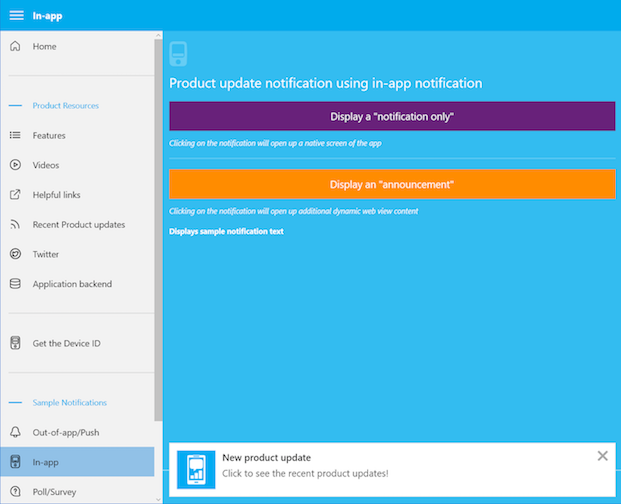

# Azure Mobile Engagement Windows Demo App

The iOS Azure Mobile Engagement demonstration application.

Increase app usage and user retention with Azure Mobile Engagement.

- Collect real-time analytics that highlight users’ behavior
- Measure and act on analytics using single dashboard
- Create dynamic segments based on collected data
- Create marketing campaigns/push notifications targeting specific segments
- Send personalized out-of-app notifications, polls, and in-app notifications with rich HTML
- Integrate and automate with CRM/CMS/IT systems using open-platform APIs
- Find SDKs for all major platforms—iOS, Android, Windows, Windows Phone 



*Screenshot from the AzME Windows Demo project.*

## Test the Demo App

### Requirements

- NuGet : See https://nuget.org
- Visual Studio 2015, the application is written in C#/.Net and targets Universal Windows Platform

### Installation 

- Open `azme.sln`

- Test locally the emulation of the SDK or create your own AzME campaigns to test push notification, Web Announcement, Poll or Data Push.
```

### Run the app : use your own AzME Endpoint 

To test the SDK and AzME Platform, configure your Endpoint in `Resources/EngagementConfiguration.xml`

```
    <connectionString>Endpoint=Your_application_endpoint</connectionString>
```
You have to configure an Endpoint otherwise you cannot be able to test the app correctly with the SDK.

You can see detailed instructions in the application to discover how to implement notification campaigns in Azure Mobile Engagement back-end. 

## Documentation

Official documentation is available on [Azure Mobile Engagement Website](https://azure.microsoft.com/en-us/documentation/services/mobile-engagement/)

## Licence : MIT

Azure Mobile Engagement App
Copyright (c) Microsoft Corporation

All rights reserved. 

MIT License

Permission is hereby granted, free of charge, to any person obtaining a copy of this software and associated documentation files (the ""Software""), to deal in the Software without restriction, including without limitation the rights to use, copy, modify, merge, publish, distribute, sublicense, and/or sell copies of the Software, and to permit persons to whom the Software is furnished to do so, subject to the following conditions:
The above copyright notice and this permission notice shall be included in all copies or substantial portions of the Software.

THE SOFTWARE IS PROVIDED *AS IS*, WITHOUT WARRANTY OF ANY KIND, EXPRESS OR IMPLIED, INCLUDING BUT NOT LIMITED TO THE WARRANTIES OF MERCHANTABILITY, FITNESS FOR A PARTICULAR PURPOSE AND NONINFRINGEMENT. IN NO EVENT SHALL THE AUTHORS OR COPYRIGHT HOLDERS BE LIABLE FOR ANY CLAIM, DAMAGES OR OTHER LIABILITY, WHETHER IN AN ACTION OF CONTRACT, TORT OR OTHERWISE, ARISING FROM, OUT OF OR IN CONNECTION WITH THE SOFTWARE OR THE USE OR OTHER DEALINGS IN THE SOFTWARE.
